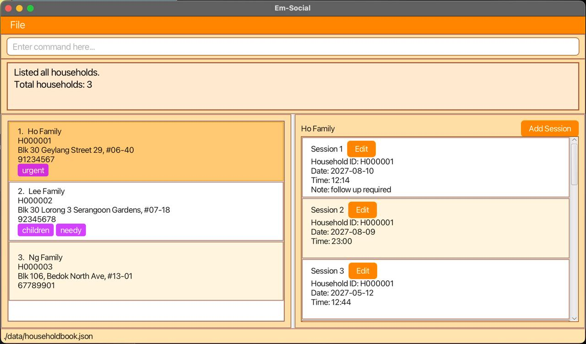

This README is currently a live document.

* For the detailed documentation of this project, see the **[Em-Social Product Website](https://ay2425s2-cs2103t-f10-2.github.io/tp/index.html)**.
* This project is a **part of the se-education.org** initiative. If you would like to contribute code to this project, see [se-education.org](https://se-education.org/#contributing-to-se-edu) for more info.
