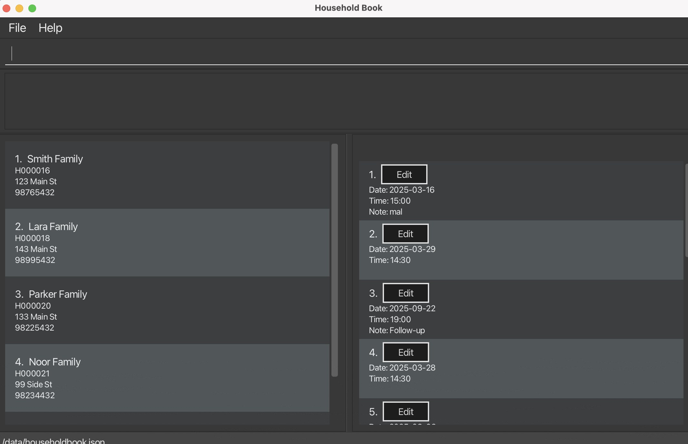

# Em-Social User Guide

## Introduction
Welcome to Em-Social, a specialized management software designed for social workers in Singapore. Em-Social streamlines household data management and session scheduling through an intuitive interface, allowing you to focus on what matters most – supporting the communities you serve.

Em-Social enables you to maintain detailed records of households, schedule and track visits, prevent scheduling conflicts, and efficiently organize your caseload through powerful filtering and search capabilities.

Em-Social is suitable for social workers who:
1. Are comfortable with text-based command entry.
2. Are familiar with tracking interactions with clients and updating notes.
3. Do not need integration with external case management systems.
4. Expect minimal mouse interaction and prefer using the keyboard.
5. Expect quick data entry without unnecessary steps.

## User Assumptions

This user guide assumes that users:

- Are social workers or professionals working with household-based social service data.
- Are familiar with tracking and managing interactions with households or clients.
- Prefer using keyboard-driven interfaces and are comfortable typing structured commands.
- Are using Em-Social on a desktop or laptop computer, not a mobile device.
- Understand the importance of client confidentiality and data protection.
- Do not require integration with external systems (e.g., national casework platforms).

If you're already familiar with similar applications, skip to [Usage](#running-em-social) for quick setup instructions.

- [Em-Social User Guide](#em-social-user-guide)
  - [Introduction](#introduction)
  - [User Assumptions](#user-assumptions)
  - [Features](#features)
  - [Usage](#usage)
    - [Running Em-Social](#running-em-social)
  - [Household Management](#household-management)
    - [Add a household](#add-a-household)
    - [Edit a household](#edit-a-household)
    - [Delete a household](#delete-a-household)
    - [List all households](#list-all-households)
    - [Find households](#find-households)
  - [Session Management](#session-management)
    - [Add a session](#add-a-session)
    - [Edit a session](#edit-a-session)
    - [Delete a session](#delete-a-session)
    - [List sessions](#list-sessions)
    - [View all sessions of a household](#view-household-sessions)
  - [User Interface Navigation](#user-interface-navigation)
    - [Household Panel](#1-household-panel)
    - [Session Panel](#2-session-panel)
    - [Command Box](#3-command-box)
    - [Result Display](#4-feedback-display)
    - [Message Colours](#5-message-colours)
  - [General Commands](#general-commands)
    - [Clear data](#clear-data)
    - [Help](#help)
    - [Exiting the program](#exiting-the-program)
  - [Saving the Data](#saving-the-data)
  - [Warnings](#warnings)
  - [Command Summary](#command-summary)

## Features
Em-Social offers the following key features:

1. **Household Management**: Add, edit, and categorize household information including name, address, contact details, and tags.
2. **Session Scheduling**: Schedule visits with households without double-booking.
3. **Session Notes**: Add detailed notes for each session to track interactions and follow-up items.
4. **Powerful Searching**: Find households based on keywords or tags.
5. **Duplicate Prevention**: System ensures no duplicate household entries exist.
6. **Interactive UI**: View households and their sessions side by side.

## Usage
### Running Em-Social
1. Ensure you have Java 17 or above installed on your computer by running:
`java -version`
If you require installation, refer to this [installation guide](https://www.oracle.com/java/technologies/javase/jdk17-archive-downloads.html)

2. Download the [latest release of Em-Social](https://github.com/AY2425S2-CS2103T-F10-2/tp/releases) from the releases page.

3. Double-click the downloaded JAR file or run it from the command line using:
`java -jar em-social.jar`

4. Use the `help` command for a quick and easy walkthrough of the available commands.

## Household Management
Households are the core entities in Em-Social. Each household represents a family or living unit that you work with.

### Add a household
You can add a new household with the `add-household` command.
```
add-household n/HOUSEHOLD_NAME a/ADDRESS p/PHONE_NUMBER
```

Example of usage:
```
add-household n/Tan Family a/Blk 30 Geylang Street 29, #06-40 p/91234567
```

Expected outcome:
```
New household added: Household H000012: Tan Family at Blk 30 Geylang Street 29, #06-40 (Contact: 91234567)
```


### Edit a household
You can modify household details with the `edit-household` command.
```
edit-household id/HOUSEHOLD_ID [n/HOUSEHOLD_NAME] [a/ADDRESS] [p/PHONE_NUMBER] [t/TAG]...
```

Example of usage:
```
edit-household id/H000001 n/Tan Family p/98765432 t/Urgent
```

Expected outcome:
```
Edited Household: Household H000001: Tan Family at Blk 30 Geylang Street 29, #06-40 (Contact: 98765432) Tags: [Urgent]
```

### Delete a household
You can remove a household with the `delete-household` command.
```
delete-household id/HOUSEHOLD_ID
```

Example of usage:
```
delete-household id/H000019
```

The following confirmation dialog box is expected:


Upon confirmation, you will see this message:
```
Deleted Household: Household H000019: sample at sample (Contact: 92039322)
```

### List all households
You can view all households with the `list-households` command.
```
list-households
```

Expected outcome (System Message):
```
Listed all households.
Total households: 4
```

### Find households
You can search for households with the `find-household` command.
Use double quotes to search for a key phrase.

```
find-household KEYWORD [MORE_KEYWORDS]...
```

Example of usage (without keyphrase):
```
find-household Tan Lee
```

Example of usage (with keyphrase):
```
find-household "Tan Family"
```

Expected outcome (without keyphrase):
```
Found 2 household(s) matching: Tan Lee
```

Expected outcome (with keyphrase):
```
1 households found:
1. Tan Family (ID: H000001)
```

## Session Management
Sessions represent scheduled visits to households.

### Add a session
You can schedule a session with the `add-session` command.
```
add-session id/HOUSEHOLD_ID d/DATE (YYYY-MM-DD) tm/TIME (HH:MM)
```

Example of usage:
```
add-session id/H000012 d/2025-05-15 tm/14:30
```

Expected outcome:
```
New session added to household H000012: Session for H000012 on 2025-05-15 at 14:30
```

### Edit a session
You can modify a session with the `edit-session` command. This command also allows you to add or update a note at the same time.
```
edit-session id/HOUSEHOLD_ID-SESSION_INDEX d/DATE tm/TIME [n/NOTE]
```

Example of usage (without note):
```
edit-session id/H000003-1 d/2025-03-16 tm/15:00
```

Example of usage (with note):
```
edit-session id/H000003-1 d/2025-03-16 tm/15:00 n/Follow-up on medical assistance application
```

Expected outcome (without note):
```
Edited session:
Date: 2025-03-16
Time: 15:00
```

Expected outcome (with note):
```
Edited session:
Date: 2025-03-16
Time: 15:00
Note: Follow-up on medical assistance application
```


### Delete a session
You can remove a session with the `delete-session` command.
```
delete-session id/HOUSEHOLD_ID-SESSION_INDEX
```

Example of usage:
```
delete-session id/H000003-1
```

Expected outcome:
```
Deleted session 1 from household H00003: Session for H000012 on 2025-03-16 at 15:00
```

### List sessions
You can view all sessions for a specific household with the `list-sessions` command.
```
list-sessions id/HOUSEHOLD_ID
```

Example of usage:
```
list-sessions id/H000003
```

Expected outcome:
```
Listed all sessions for household H000003:
1. Date: 2025-03-15, Time: 14:30
2. Date: 2025-04-01, Time: 10:00
```


### View Household Sessions
You can switch to all existing sessions for a household using the `view-household-sessions` command.
```
view-household-sessions id/HOUSEHOLD_ID
```

Example of usage:
```
view-household-sessions id/H000003
```

Expected outcome:
```
Viewing sessions for household: H000003
```


## User Interface Navigation


### 1. Household Panel
The household panel displays household information such as name, address, contact number and any tags. Click on a household to view its session panel.

### 2. Session Panel
The session panel displays session information for the selected household. This includes household id, session dates, times, and any session notes.

### 3. Command Box
Enter commands in the command box of the application window. Press Enter/Return to execute the command.

### 4. Result Display
The result display shows the outcome of your most recent command, primarily success messages or error notifications.

### 5. Message Colours
Em-Social uses coloured messages in the Result Display area to help you quickly understand outcomes:
- ❌ **Error messages** (e.g., "Invalid command") appear in **red**.

These colour cues are designed to reduce the chance of errors and improve the user experience, especially for users working in high-volume environments.

## General Commands

### Clear data
You can clear all household and session data with the `clear` command.
```
clear
```

The following confirmation dialog box is expected:


Upon confirmation, you will see this message:
```
All entries have been cleared.
```

### Help
You can view a summary of available commands with the `help` command.
```
help
```

### Exiting the program
You can exit Em-Social with the `exit` command.
```
exit
```

## Saving the Data
Em-Social automatically saves data to a local file after each command. There is no need to save manually.

## Warnings

Em-Social performs certain actions that cannot be undone once confirmed. Please take note of the following:

- ⚠️ **Deleting a household or session is irreversible.**
- ⚠️ **Using the `clear` command will remove all data from the system.** Only use it if you're sure you want to start fresh.
- The system does not prompt for confirmation when editing data, so always double-check your input before submitting.

## Command Summary

| Action                  | Format                                                                                   | Example                                                                    |
|-------------------------|------------------------------------------------------------------------------------------|----------------------------------------------------------------------------|
| Add household           | `add-household n/HOUSEHOLD_NAME a/ADDRESS p/PHONE_NUMBER`                                | `add-household n/Tan Family a/Blk 30 Geylang Street 29, #06-40 p/91234567` |
| Edit household          | `edit-household id/HOUSEHOLD_ID [n/HOUSEHOLD_NAME] [a/ADDRESS] [p/PHONE_NUMBER] [t/TAG]` | `edit-household H000001 n/Tan Family (Urgent) p/98765432`                  |
| Delete household        | `delete-household ID`                                                                    | `delete-household H000001`                                                 |
| List households         | `list-households`                                                                        | `list-households`                                                          |
| Find households         | `find-household KEYWORD [MORE_KEYWORDS]...`                                              | `find-household Tan Lee`                                                   |
| Add session             | `add-session id/HOUSEHOLD_ID d/DATE (YYYY-MM-DD) tm/TIME (HH:MM)`                        | `add-session id/H000003 d/2025-03-15 tm/14:30`                             |
| Edit session            | `edit-session id/HOUSEHOLD_ID-SESSION_INDEX d/DATE tm/TIME [n/NOTE]`                     | `edit-session id/H000003-1 d/2025-03-16 tm/15:00 n/Follow-up note`         |
| Delete session          | `delete-session id/HOUSEHOLD_ID-SESSION_INDEX`                                           | `delete-session id/H000003-1`                                              |
| List sessions           | `list-sessions id/HOUSEHOLD_ID`                                                          | `list-sessions id/H000003`                                                 |
| View household sessions | `view-household-sessions id/HOUSEHOLD_ID`                                                | `view-household-sessions id/H000003`                                       |
| Clear data              | `clear`                                                                                  | `clear`                                                                    |
| Help                    | `help`                                                                                   | `help`                                                                     |
| Exit                    | `exit`                                                                                   | `exit`                                                                     |

## Glossary

* Household: Each household represents a family or living unit that you work with.
* Household ID: A unique identifier (e.g, H000001) for each household.
* Session: A scheduled appointment between a social service worker and a household for follow-up, assistance, or other social services.
* Session Index: The number assigned to each session for a household, used in commands like `edit-session` or `delete-session`.
* Tag: A keyword or label assigned to a household record to categorize or identify it easily (e.g, "Urgent", "Follow up required").
* Double-Booking: A scheduling conflict where two sessions are assigned to the same time slot, which the system should prevent.
* Filter: A feature that allows users to refine search results based on specific criteria like name, address, or tags.
* Session Data: Information related to a user's current interaction with the system, including active records, scheduled sessions, and temporary changes before they are saved.
* Command Box: The input field where the user type commands.
* Confirmation Dialog: A popup window that appears before irreversible actions.
* Result Display: Thea area where success/error messages appear.
