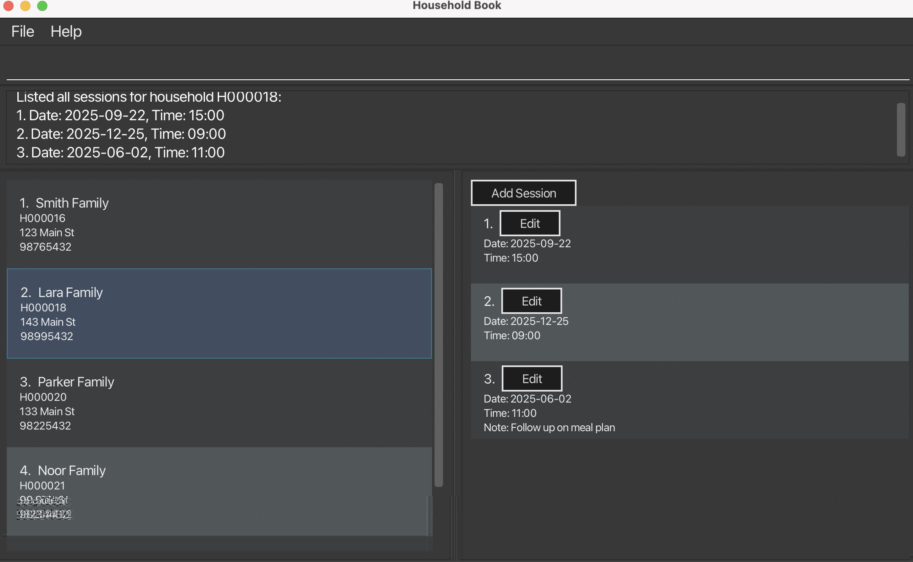

# Em-Social User Guide

## Introduction
Welcome to Em-Social, a specialized management software designed for social workers in Singapore. Em-Social streamlines household data management and session scheduling through an intuitive interface, allowing you to focus on what matters most – supporting the communities you serve.

Em-Social enables you to maintain detailed records of households, schedule and track visits, prevent scheduling conflicts, and efficiently organize your caseload through powerful filtering and search capabilities.

### Who is Em-Social for?
Em-Social is designed specifically for social workers who:
1. Manage multiple household cases simultaneously
2. Need to schedule and track regular home visits
3. Require a simple way to maintain case notes and follow-ups
4. Work in community service centers or family service centers
5. Need a lightweight solution that works offline

### Assumptions about our users
We assume our users:
1. Are comfortable with basic typing and text-based commands
2. Have basic computer literacy (can navigate files, install programs)
3. Prefer keyboard-based workflows over extensive mouse navigation
4. Need to quickly enter and retrieve information during busy workdays
5. May have limited technical support in their workplace

If you're already familiar with similar applications, skip to [Quick Start](#quick-start) for setup instructions.

--------------------------------------------------------------------------------------------------------------------

## Quick Start

1. Ensure you have Java 17 or above installed on your computer by opening the terminal application on your computer and enter:
   ```
   java -version
   ```
   If you require installation, refer to this [Java Installation Guide](https://www.oracle.com/java/technologies/javase/jdk11-archive-downloads.html)

2. Download the [latest release of Em-Social](https://github.com/AY2425S2-CS2103T-F10-2/tp/releases) from the releases page.

3. Double-click the downloaded JAR file or run it from the command line using:
   ```
   java -jar em-social.jar
   ```

4. The application will start with sample data to help you get familiar with the interface.

5. Type `help` in the command box and press Enter to see available commands.

--------------------------------------------------------------------------------------------------------------------

## User Interface Overview


The Em-Social interface consists of five main sections:

1. **Household Panel** - Displays all households in your database
2. **Session Panel** - Shows sessions for the selected household
3. **Command Box** - Where you type commands
4. **Result Display** - Shows feedback from your commands
5. **Message Colours** - Coloured messages help you quickly understand outcomes:
- ❌ **Error messages** (e.g., "Invalid command") appear in **red**.

*These colour cues are designed to reduce the chance of errors and improve the user experience, especially for users working in high-volume environments.*

--------------------------------------------------------------------------------------------------------------------

## Command Syntax Guide
Before using the commands, please understand these conventions:

### Parameter Reference
All commands use the following format:
`command-name prefix/PARAMETER [optional-prefix/OPTIONAL_PARAMETER]...`

| Parameter                       | Meaning                               | Valid Examples                    |
|---------------------------------|---------------------------------------|-----------------------------------|
| `n/HOUSEHOLD_NAME`              | Name of household (e.g, family name)  | `n/Tan Family`, `n/Lee Household` |
| `a/ADDRESS`                     | Household address                     | `a/Blk 30 Geylang St, #06-40`     |
| `p/PHONE_NUMBER`                | 8-digit Singapore phone number        | `p/91234567`, `p/62221234`        |
| `id/HOUSEHOLD_ID`               | Unique household ID                   | `id/H000001`, `id/H000123`        |
| `id/HOUSEHOLD_ID-SESSION_INDEX` | Combined household ID + session index | `id/H000001-1`, `id/H000123-3`    |
| `d/DATE`                        | Date in YYYY-MM-DD format             | `d/2025-03-15`, `d/2025-12-31`    |
| `tm/TIME`                       | Time in 24-hour HH:MM format          | `tm/09:00`, `tm/14:30`            |
| `t/TAG`                         | Category label (no spaces)            | `t/elderly`, `t/financial_aid`    |
| `n/NOTE`                        | Session notes (free text)             | `n/Medical follow-up scheduled`   |

### Special Syntax
| Symbol          | Meaning                                  | Example                          |
|-----------------|------------------------------------------|----------------------------------|
| `[ ]`           | Optional parameter                       | `[t/TAG]`                        |
| `...`           | Can repeat multiple times                | `[t/TAG]...`                     |
| `" "`           | Exact phrase matching in searches        | `find "Tan Family"`              |
| UPPERCASE       | Replace with actual value                | `n/NAME` → `n/Tan Family`        |

--------------------------------------------------------------------------------------------------------------------

## Household Management
Households are the core entities in Em-Social. Each household represents a family or living unit that you work with.

### Add a household
You can add a new household with the `add` command.
```
add n/HOUSEHOLD_NAME a/ADDRESS p/PHONE_NUMBER
```

Example of usage:
```
add n/Ng Family a/Blk 44 Bedok North Street, #13-03 p/95553737
```

Expected outcome:
```
New household added: Household H000004: Ng Family at Blk 44 Bedok North Street, #13-03 (Contact: 95553737)
```


> **Tip**: Use meaningful tags to categorize households for easier filtering later. Common tags might include "elderly", "children", "financial-assistance", or "priority".

### Edit a household
You can modify household details with the `edit` command.
```
edit id/HOUSEHOLD_ID [n/HOUSEHOLD_NAME] [a/ADDRESS] [p/PHONE_NUMBER] [t/TAG]...
```

Example of usage:
```
edit id/H000001 n/Tan Family p/98765432 t/Urgent
```

Expected outcome:
```
Edited Household: Household H000001: Tan Family at Blk 30 Geylang Street 29, #06-40 (Contact: 98765432) Tags: [Urgent]
```

> **Warning**: Editing a household to match an existing household will be rejected to prevent duplicates.

### Delete a household
You can remove a household with the `delete` command.
```
delete id/HOUSEHOLD_ID
```

Example of usage:
```
delete id/H000004
```

The following confirmation dialog box will appear:


Upon confirmation, you will see this message:
```
Deleted Household: Household H000004: Ng Family at Blk 44 Bedok North Street, #13-03 (Contact: 95553737)
```

> **Warning**: Deleting a household will also delete all associated sessions. This action cannot be undone.

### List all households
You can view all households with the `list` command.
```
list
```

Expected outcome (System Message):
```
Listed all households.
Total households: 4
```

> **Tip**: Use this command to refresh your view after searching or filtering.

### Find households
You can search for households with the `find` command.
Use double quotes to search for a key phrase.
> **Note**: You cannot search for session content (including notes) using this command.


```
find KEYWORD [MORE_KEYWORDS]...
```

Example of usage:
```
find Tan Lee
```

Expected outcome:
```
Found 2 household(s) matching: Tan Lee
```

> **Tip**: Use double quotes for exact phrase matching: `"Tan Family"`

Example of usage (with phrase matching):
```
find "Tan Family"
```

Expected outcome (with phrase matching):
```
1 households found:
1. Tan Family (ID: H000001)
```
> **Tip**: The search is case-insensitive and matches partial words. For example, "Tan" will match "Tan Family" and "Tanaka".

--------------------------------------------------------------------------------------------------------------------

## Session Management
Sessions represent scheduled visits or meetings with households.

### Add a session
You can schedule a session with the `add-session` command.
```
add-session id/HOUSEHOLD_ID d/DATE tm/TIME
```

Example of usage:
```
add-session id/H000001 d/2025-05-15 tm/14:30
```

Expected outcome:
```
New session added to household H000012: Session for H000012 on 2025-05-15 at 14:30
```

> **Warning**: The system will prevent double-booking if you already have another session scheduled at the same time.

### Edit a session
You can modify a session with the `edit-session` command.
```
edit-session id/HOUSEHOLD_ID-SESSION_INDEX d/DATE tm/TIME [n/NOTE]
```

Example of usage (with note):
```
edit-session id/H000003-1 d/2025-03-16 tm/15:00 n/Follow-up on medical assistance application
```

Expected outcome:
```
Edited session:
Date: 2025-03-16
Time: 15:00
Note: Follow-up on medical assistance application
```


> **Tip**: Use session notes to record key discussion points, action items, or observations during your visit.

### Delete a session
You can remove a session with the `delete-session` command.
```
delete-session id/HOUSEHOLD_ID-SESSION_INDEX
```

Example of usage:
```
delete-session id/H000001-1
```

Expected outcome:
```
Deleted session 1 from household H000001: Session for H000001 on 2025-03-16 at 15:00
```

### List sessions
You can view all sessions for a specific household with the `list-sessions` command.
```
list-sessions id/HOUSEHOLD_ID
```

Example of usage:
```
list-sessions id/H000001
```

Expected outcome:
```
Listed all sessions for household H000001:
1. Date: 2025-03-15, Time: 14:30
2. Date: 2025-04-01, Time: 10:00
```



### View household sessions
You can switch to view all existing sessions for a household using the `view-household-sessions` command.
```
view-household-sessions id/HOUSEHOLD_ID
```

Example of usage:
```
view-household-sessions id/H000001
```

Expected outcome:
```
Viewing sessions for household: H000001
```


--------------------------------------------------------------------------------------------------------------------

## General Commands

### Clear data
You can clear all household and session data with the `clear` command.
```
clear
```

The following confirmation dialog box will appear:


Upon confirmation, you will see this message:
```
All entries have been cleared.
```

> **Warning**: This action will delete ALL households and sessions. It cannot be undone.

### Help
You can view a summary of available commands with the `help` command.
```
help
```

### Exiting the program
You can exit Em-Social with the `exit` command.
```
exit
```

--------------------------------------------------------------------------------------------------------------------

## Tips for Effective Use

1. **Warnings**
Em-Social performs certain actions that cannot be undone once confirmed. Please take note of the following:
   - ⚠️ **Deleting a household or session is irreversible.**
   - ⚠️ **Using the `clear` command will remove all data from the system.** Only use it if you're sure you want to start fresh.
   - The system does not prompt for confirmation when editing data, so always double-check your input before submitting.

2. **Tagging Strategy**
   - Use consistent tags across households for better organization
   - Consider tags for case type (e.g., `financial`, `medical`, `housing`)
   - Use tags for priority levels (e.g., `urgent`, `follow-up`, `completed`)
   - Add tags for special needs (e.g., `elderly`, `children`, `disability`)

3. **Session Planning**
   - Schedule sessions at least 30 minutes apart to allow for travel time
   - Add detailed notes immediately after sessions while details are fresh
   - Use the list-sessions command to review your upcoming schedule

4. **Data Management**
   - While Em-Social automatically saves data to a local file after each command, consider:
   - Regularly backing up your data file (located at `data/householdbook.json`)
   - Creating separate backups for different periods (monthly/quarterly)

5. **Efficient Workflows**
   - Group visits by geographic area to minimize travel time
   - Use the find command with area names to identify nearby cases
   - Add time estimates to session notes for better future planning

--------------------------------------------------------------------------------------------------------------------

## Frequently Asked Questions

**Q: Can I import data from other case management systems?**
A: Currently, Em-Social doesn't support direct imports. You'll need to manually enter household information.

**Q: How many households can Em-Social handle?**
A: Em-Social can efficiently manage hundreds of households, though performance may decrease with extremely large datasets (1000+).

**Q: Is my data secure?**
A: Em-Social stores all data locally on your computer. No data is sent to external servers. For sensitive data, ensure your computer is secured with a password and consider encrypting your drive.

**Q: Can multiple social workers use Em-Social simultaneously?**
A: Em-Social is designed for individual use. For team settings, each social worker should use their own instance of the application.

**Q: What happens if I accidentally delete a household?**
A: Unfortunately, there's no built-in recovery for deleted households. This is why Em-Social asks for confirmation before deletion. Consider regular backups of your data file.

**Q: Can I customize the fields for households?**
A: The current version has fixed fields. Future versions may include customizable fields based on user feedback.

**Q: How do I report bugs or request features?**
A: Please submit issues on our [GitHub repository](https://github.com/AY2425S2-CS2103T-F10-2/tp/issues).

--------------------------------------------------------------------------------------------------------------------

## Glossary

* **Household**: A family or living unit that receives social services, represented as a single entity in Em-Social.
* **Household ID**: A unique identifier (e.g, H000001) for each household.
* **Session**: A scheduled appointment between a social worker and a household for follow-up, assistance, or other social services.
* **Session Index**: The number assigned to each session for a household, used in commands like `edit-session` or `delete-session`.
* **Tag**: A keyword or label assigned to a household record to categorize or identify it easily.
* **Double-Booking**: A scheduling conflict where two sessions are assigned to the same time slot, which Em-Social prevents automatically.
* **Case Notes**: Detailed information recorded during or after a session, documenting observations, actions taken, and follow-up items.
* **Command Box**: The text input area at the bottom of the application where you type commands.
* **Confirmation Dialog**: A popup window that appears before irreversible actions.
* **Result Display**: The area that shows feedback after executing a command.
* **Household Panel**: The left section of the interface that displays the list of households.
* **Session Panel**: The right section of the interface that shows sessions for the selected household.

--------------------------------------------------------------------------------------------------------------------

## Command Summary

<div class="wide-table">  <!-- Added container for better table control -->

| Action               | Command Format                                                   | Examples                                                           |
|----------------------|------------------------------------------------------------------|--------------------------------------------------------------------|
| **Add Household**    | `add n/NAME a/ADDRESS p/PHONE [t/TAG]...`              | `add n/Tan Family a/Blk 30 Geylang p/91234567 t/elderly` |
| **Edit Household**   | `edit id/ID [n/NAME] [a/ADDRESS] [p/PHONE] [t/TAG]...` | `edit id/H000001 n/Lim Family p/87654321`                |
| **Delete Household** | `delete id/ID`                                         | `delete id/H000001`                                      |
| **List Households**  | `list`                                                | `list`                                                  |
| **Find Households**  | `find KEYWORD [MORE_KEYWORDS]...`                      | `find "Tan Lee"`                                         |
| **Add Session**      | `add-session id/ID d/DATE tm/TIME`                               | `add-session id/H000001 d/2025-05-15 tm/14:30`                     |
| **Edit Session**     | `edit-session id/ID-INDEX d/DATE tm/TIME [n/NOTE]`               | `edit-session id/H000001-1 d/2025-03-16 tm/15:00 n/Follow-up`      |
| **Delete Session**   | `delete-session id/ID-INDEX`                                     | `delete-session id/H000001-1`                                      |
| **List Sessions**    | `list-sessions id/ID`                                            | `list-sessions id/H000001`                                         |
| **View Sessions**    | `view-household-sessions id/ID`                                  | `view-household-sessions id/H000001`                               |
| **Clear Data**       | `clear`                                                          | `clear`                                                            |
| **Help**             | `help`                                                           | `help`                                                             |
| **Exit**             | `exit`                                                           | `exit`                                                             |

</div>

> **Legend**:
> - **UPPERCASE** terms: Replace with actual values
> - **[square brackets]**: Optional parameters
> - `...`: Can be repeated multiple times
> - `id/ID-INDEX`: Household ID followed by session number (e.g., H000001-1)
