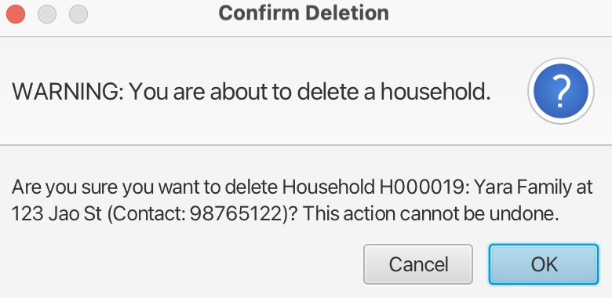
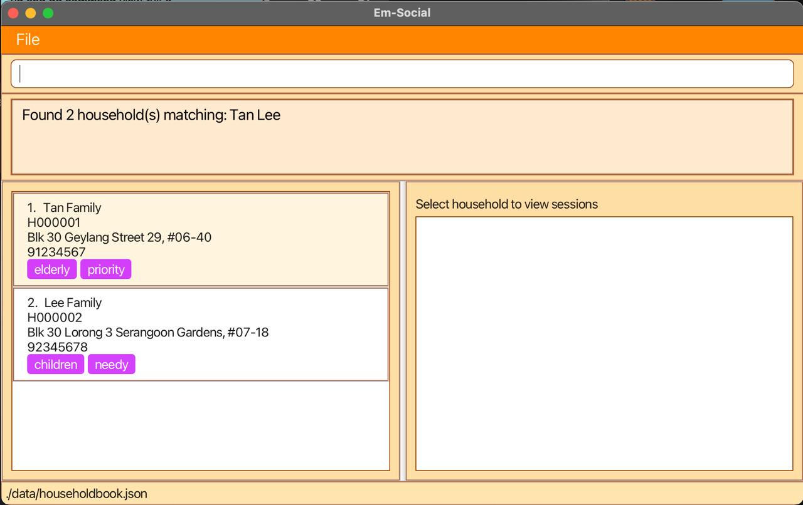
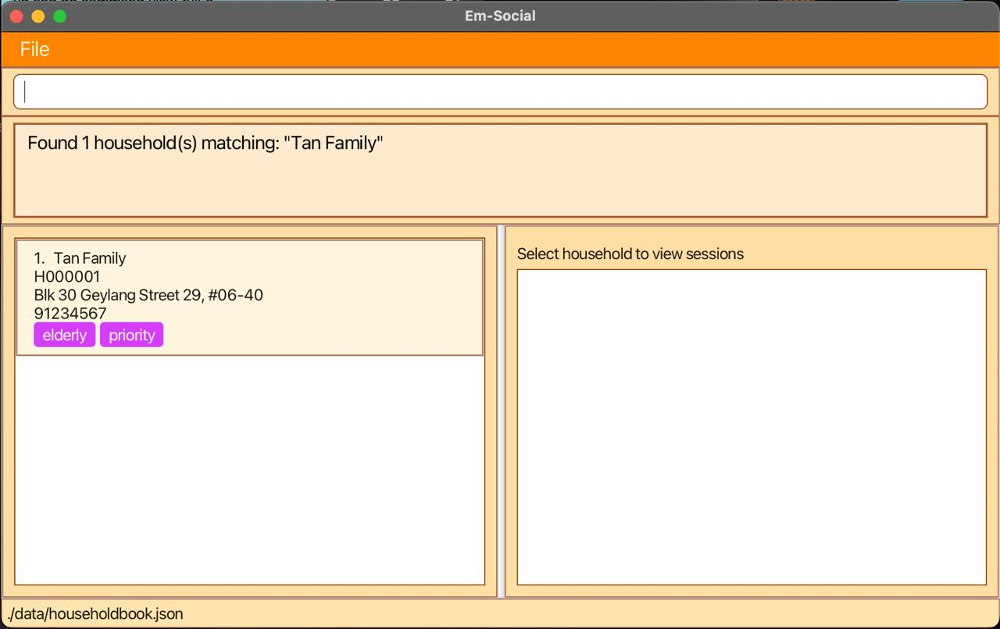
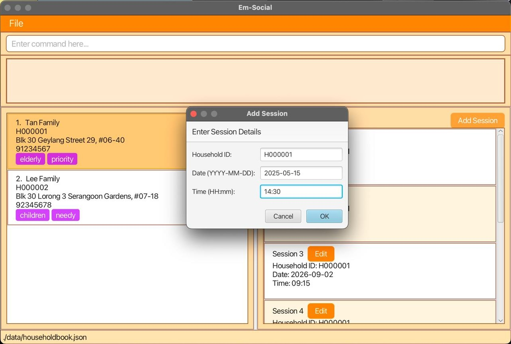
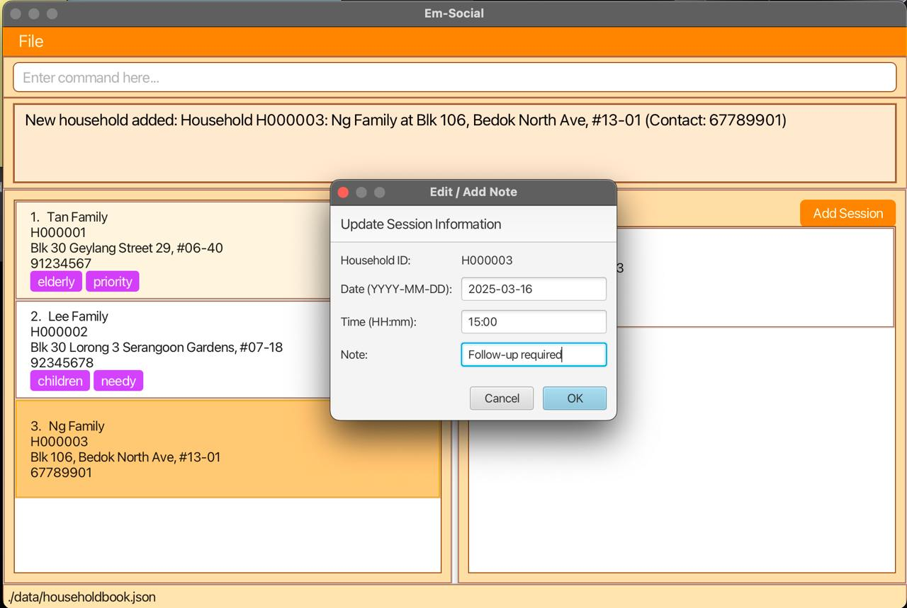
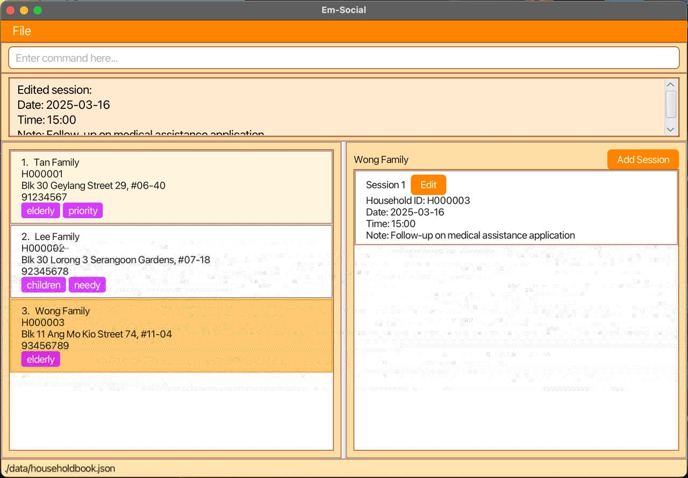
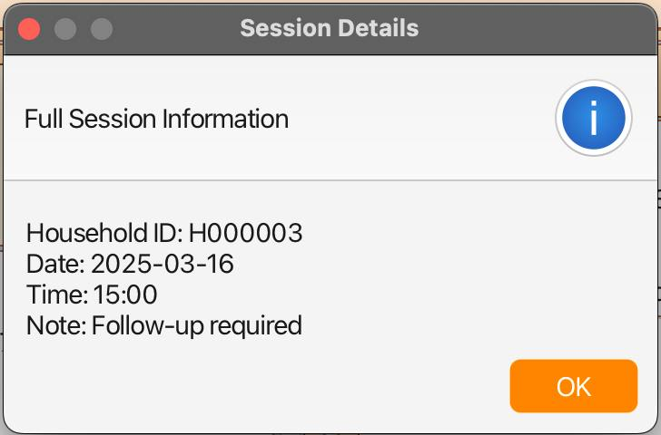
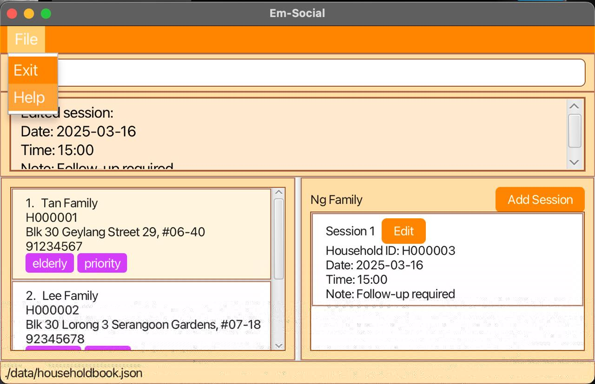

# Em-Social User Guide

## 👋 Introduction
Welcome to **Em-Social**, a desktop application designed to streamline **scheduling** and **household management** for **social service workers**!
Through a Command Line Interface (CLI), Em-Social lets you seamlessly **organise, categorise, and access your schedules and household records**.

### Why Em-Social?
Em-Social is designed specifically for social workers in **Singapore** who:
1. 📂 Manage **multiple** household cases simultaneously
2. 📆 Need to schedule and track **regular** home visits
3. 📝 Require a **simple** way to maintain case notes and follow-ups
4. 🏢 Work in community service centers or family service centers
5. 📴 Need a **lightweight** solution that works offline

Em-Social thereby frees you up to focus on what matters most: **supporting the communities you serve!** ❤️

👉 If you're already familiar with similar applications, skip ahead to 🚀 [Quick Start](#-quick-start) for setup instructions.  
👉 If you're a new user, we suggest you read the Em-Social User Guide sequentially to make the most of it!

## Table of Contents
- [Em-Social User Guide](#em-social-user-guide)
   - [Introduction](#-Introduction)
   - [Quick Start](#-quick-start)
   - [User Interface Overview](#-user-interface-overview)
   - [Household Management](#-household-management)
      - [Add a household](#add-a-household): `add`
      - [Edit a household](#edit-a-household): `edit`
      - [Delete a household](#delete-a-household): `delete`
      - [Find households](#find-households): `find`
      - [List all households](#list-all-households): `list`
   - [Session Management](#-session-management)
      - [Add a session](#add-a-session): `add-s`
      - [Edit a session](#edit-a-session): `edit-s`
      - [Delete a session](#delete-a-session): `delete-s`
      - [View full session](#view-full-session): `view-full-s`
      - [View household sessions](#view-household-sessions): `view-s`
   - [General Commands](#-general-commands)
      - [Clear data](#clear-data): `clear`
      - [Help](#help): `help`
      - [Exiting the program](#exiting-the-program): `exit`
   - [Make the Most out of Em-Social](#-make-the-most-out-of-em-social)
   - [Frequently Asked Questions](#-frequently-asked-questions)
   - [Glossary](#-glossary)
   - [Command Summary](#-command-summary)


--------------------------------------------------------------------------------------------------------------------

## 🚀 Quick Start

1. **Ensure Java is Installed**  
   Make sure you have Java `17` or a newer version installed on your computer. To check your Java version, open your terminal and type:
   ```bash
   java -version
   ```
   If Java is not installed, or you have an older version, download and install the latest version from [this link](https://www.oracle.com/java/technologies/javase-jdk17-downloads.html).

2. **Download Em-Social**  
   Download the latest release of Em-Social from the [Em-Social releases page](https://github.com/AY2425S2-CS2103T-F10-2/tp/releases). Look for the latest `em-social.jar` file in the list of assets.

3. **Save the Downloaded File**  
   Move the downloaded `em-social.jar` file to the folder where you want to keep Em-Social. This could be your Desktop or a dedicated folder for the application.

4. **Open a Command Terminal**  
   Open a command terminal on your computer:
    - **Windows:** Press `Win + R`, type `cmd`, and press `Enter`.
    - **macOS:** Press `Cmd + Space`, type `Terminal`, and press `Enter`.
    - **Linux:** Press `Ctrl + Alt + T`.  

5. **Navigate to the Application Folder**  
   In your terminal, navigate to the folder where you saved the `em-social.jar` file using the `cd` command. For example:
    - **Windows:**
      ```bash
      cd C:\Users\YourName\Desktop\Em-Social
      ```
    - **macOS/Linux:**
      ```bash
      cd /Users/YourName/Desktop/Em-Social
      ```

6. **Run Em-Social**  
   Launch the application by typing the following command in the terminal and pressing `Enter`:
   ```bash
   java -jar em-social.jar
   ```
   Within a few seconds, a graphical user interface (GUI) should appear. The application will start with sample data to help you get familiar with its features.

7. **Running Your First Commands**  
   Once the application is running, type `help` in the command box and press `Enter` to see a list of available commands. Some command examples:
    - **`list`**: Lists all households.
    - **`add`**: Adds a new household.
    - **`edit`**: Edits an existing household.

Now you're ready to start using Em-Social!  

--------------------------------------------------------------------------------------------------------------------

## 🖥️ User Interface Overview

<br>
*Figure 1: The Em-Social UI, showing layout and sample data*

The Em-Social interface consists of five main sections:

1. **Command Box** - Where you type commands
2. **Result Display** - Shows feedback from your commands
3. **Household Panel** - Displays all households in your database
4. **Session Panel** - Shows sessions for the selected household

--------------------------------------------------------------------------------------------------------------------

<div style="border-left: 4px solid #007ACC; padding: 0.75em 1em; background-color: #f0f8ff;">

🔍 <strong>Before We Begin:</strong>

<ul>
  <li>For commands that do not take in parameters (<code>help</code>, <code>list</code>, <code>clear</code>, <code>exit</code>), additional text after the command will be <strong>ignored</strong>.<br>
  <em>e.g.</em> <code>help 123</code> will be processed as <code>help</code></li>

 <li>
    Command parameters can be provided in any order. For example, <code>add-s id/H0000002-2 d/2025-02-02 tm/18:18</code> is equivalent to <code>add-s id/H0000002-2 tm/18:18 d/2025-02-02</code>.
  </li>

  <li>For commands that do take in parameters, multiple instances of the same parameter are allowed. Except for tags, Em-Social will only process the <strong>last instance</strong> of the parameter. Multiple tags are allowed.<br>
  <em>e.g.</em> <code>add n/johnson n/robinson a/Tanglin Road p/91283882</code> will result in <code>robinson</code> being added as the household name, not <code>johnson</code></li>

  <li>To safeguard against accidental typos, double command words will result in the <strong>initial command</strong> being processed.<br>
  <em>e.g.</em> <code>edit edit id/H000001 n/Johnson</code> will be processed as <code>edit id/H000001 n/Johnson</code><br>
  <em>e.g.</em> <code>add edit n/Robertson a/Robinson Quay p/91283844</code> will be processed as <code>add n/Robertson a/Robinson Quay p/91283844</code></li>

  <li>  If a specific parameter is erroneous, the rest of the command will be ignored and the initial error will be displayed to you.<br>
  <em>e.g.</em> <code>add n/bert$ a/ p/</code> will return the error <code>Names may only contain alphanumeric characters or spaces, slashes (/), apostrophes ('), and dashes (-).</code> even though the empty <code>a/</code> and <code>p/</code> fields are also invalid.</li>
</ul>
</div>


<br>  

## 🏠 Household Management
Households are the core entities in Em-Social. Each household represents a family or living unit that you work with.


### Add a household
You can add a new household with the `add` command.
```
add n/HOUSEHOLD_NAME a/ADDRESS p/PHONE_NUMBER
```

**Parameters:**
- `n/HOUSEHOLD_NAME`: Name of the household (e.g., family name)
- `a/ADDRESS`: Physical address of the household
- `p/PHONE_NUMBER`: Contact number for the household

**Example of usage:**
```
add n/Ng Family a/Blk 44 Bedok North Street, #13-03 p/95553737
```
- This generates a Household ID and adds a Household with the following details to Em-Social: <br>
   - Household name: Ng Family <br>
   - Address: Blk 44 Bedok North Street, #13-03 <br>
   - Phone number: 95553737 <br>

<br>
*Figure 2: Result of adding the "Ng Family" Household*

You can also include unique names and different phone number formats!
```
add n/Conor O'Brien a/Charleson Road p/81277882
add n/Viknesh s/o Balakrishnan a/24 Nassim Hill p/62930129
```

<div style="background-color: #e6ffed; padding: 10px; border-left: 5px solid #2ecc71; margin-bottom: 10px;">
💡<strong>Tip:</strong> You should use the edit command <strong>below</strong> to categorize households added with tags.
</div>

<br>

---

### Edit a household
You can modify household details with the `edit` command.
```
edit id/HOUSEHOLD_ID [n/HOUSEHOLD_NAME] [a/ADDRESS] [p/PHONE_NUMBER] [t/TAG]...
```

**Parameters:**
- `id/HOUSEHOLD_ID`: The Household ID (e.g., H000001)
- `[n/HOUSEHOLD_NAME]`: Optional new name for the household
- `[a/ADDRESS]`: Optional new address
- `[p/PHONE_NUMBER]`: Optional new contact number
- `[t/TAG]...`: Optional tags, **must be a single word** and cannot be blank (will replace all existing tags)

**Example of usage:**
```
edit id/H000001 n/Tan Family p/98765432 t/Urgent
```
- This edits the Household with ID: H000001 to the following details: <br>
    - Household name: Tan Family <br>
    - Phone number: 98765432 <br>
    - Tag: Urgent

<div style="background-color: #fff3cd; padding: 10px; border-left: 5px solid #ff9900; margin-bottom: 10px;">
⚠️ <strong>Warnings:</strong><br>
- If you edit a household to match an existing household, it will be rejected to prevent duplicate households.<br>
- When you edit a household, existing values will be <strong>overwritten</strong> by the input values.
</div>

<div style="background-color: #e6ffed; padding: 10px; border-left: 5px solid #2ecc71; margin-bottom: 10px;">
💡<strong>Tip:</strong> You can add <strong>meaningful tags</strong> to categorize households for easier filtering later. Common tags might include "elderly" or "priority".
</div>
  
<br>

---

### Delete a household
You can remove a household with the `delete` command.
```
delete id/HOUSEHOLD_ID
```

**Example of usage:**
```
delete id/H000004
```
- This deletes the Household with ID/H000004

The following confirmation dialog box will appear:  
<br>
*Figure 3: Warning message to delete the "Ng Family" household at Household ID: H000004*


<div style="background-color: #fff3cd; padding: 10px; border-left: 5px solid #ff9900; margin-bottom: 10px;">
⚠️ <strong>Warning:</strong> Deleting a household will also delete <strong>all</strong> associated sessions. This action <strong>cannot</strong> be undone.
</div>

<br>

---

### Find households
You can search for households with the `find` command.
Use double quotes to search for a key phrase.
> **Note**: You **cannot** search for session content (including notes) or Household IDs using this command.


```
find KEYWORD [MORE_KEYWORDS]...
```

**Parameters:**
- `KEYWORD`: Search term to match against 
  - Household names
  - Addresses
  - Tags
- `""`: (double quotes) for exact phrase matching (e.g "Tan Family")

**Example of usage:**
```
find Tan Lee
```
- This finds the Households that include the keywords "Tan" and "Lee".


<br>
*Figure 4: Result of find command using the keyword "Tan Lee"*

<div style="background-color: #e6ffed; padding: 10px; border-left: 5px solid #2ecc71; margin-bottom: 10px;">
💡<strong>Tip:</strong><br>Use double quotes for exact phrase matching: "Tan Family"
</div>

<br>

**Example of usage (with phrase matching):**
```
find "Tan Family"
```
- This finds the Household/s that *exactly* match the keyword "Tan Family".


<br>
*Figure 5: Result of find command using the keyword "Tan Family" to find an **exact** match*

<div style="background-color: #e6ffed; padding: 10px; border-left: 5px solid #2ecc71; margin-bottom: 10px;">
💡<strong>Tips:</strong><br>
- The search is case-insensitive and matches partial words. For example, if you look for "Tan", it will match "Tan Family" and "Tanaka".<br>
- You should use the [list](#list-all-households) command to refresh your view after searching or filtering.
</div>

<br>

---

### List all households
You can view all households with the `list` command.
```
list
```
- This will bring you back to the Em-Social page with all the Households listed.

<br>

--------------------------------------------------------------------------------------------------------------------

## ⏱️ Session Management
Sessions represent scheduled visits or meetings with households.

### Add a session
You can schedule a session with the `add-s` command.
```
add-s id/HOUSEHOLD_ID d/DATE tm/TIME
```

**Parameters:**
- `id/HOUSEHOLD_ID`: The Household ID (e.g., H000001)
- `d/DATE`: Date in YYYY-MM-DD format
- `tm/TIME`: Time in 24-hour format (HH:MM)

**Example of usage:**
```
add-s id/H000001 d/2025-05-15 tm/14:30
```
- This adds a session to Tan Family at Household ID: H000001
    - The Session ID is generated at:
        - Date: 2025-05-15 (15th May, 2025)
        - Time: 14:30 (2:30pm)

You can also use the **GUI**:

<br>
*Figure 6: Using the GUI "Add Session" button*


<div style="background-color: #fff3cd; padding: 10px; border-left: 5px solid #ff9900; margin-bottom: 10px;">
⚠️ <strong>Warning:</strong> The system will prevent double-booking if you already have another session scheduled at the <strong>same</strong> time.</div>

<div style="background-color: #e6ffed; padding: 10px; border-left: 5px solid #2ecc71; margin-bottom: 10px;">
💡<strong>Tip:</strong> You can use the edit-s command <strong>below</strong> to add <strong>notes</strong> to existing sessions.
</div>

<br>

---
### Edit a session
You can modify a session with the `edit-s` command.  
*Internal whitespaces between the ```HOUSEHOLD_ID``` and ```SESSION_INDEX``` will be trimmed.*  
```
edit-s id/HOUSEHOLD_ID-SESSION_INDEX d/DATE tm/TIME [n/NOTE]
```

**Parameters:**
- `id/HOUSEHOLD_ID-SESSION_INDEX`: Household ID and session index (e.g., H000001-1)
- `d/DATE`: New date in YYYY-MM-DD format
- `tm/TIME`: New time in 24-hour format (HH:MM)
- `[n/NOTE]`: For adding an optional note about the session, all previous notes will be overwritten

**Example of usage (with note):**
```
edit-s id/H000003-1 d/2025-06-07 tm/15:00 n/Follow-up required
```
- This edits Session Number 1 for Household ID: H000003 with a note added:
    - Date: 2025-06-07 (7th June, 2025)
    - Time: 15:00 (3:00pm)
    - Note: Follow-up required

You can also use the **GUI**:

<br>
*Figure 7: Using the GUI "Edit Session" button*

<br>

<br>
*Figure 8: Confirmation message ensuring that the session has been added successfully*

<div style="background-color: #fff3cd; padding: 10px; border-left: 5px solid #ff9900; margin-bottom: 10px;">
⚠️ <strong>Warning:</strong> When you edit a session, the existing values will be <strong>overwritten</strong> by the input values.
</div>

<div style="background-color: #e6ffed; padding: 10px; border-left: 5px solid #2ecc71; margin-bottom: 10px;">
💡<strong>Tip:</strong> You should add <strong>session notes</strong> to record key discussion points, action items, or observations during your visit.
</div>

<br>

---

### Delete a session
You can remove a session with the `delete-s` command.
```
delete-s id/HOUSEHOLD_ID-SESSION_INDEX
```

**Parameters:**
- `id/HOUSEHOLD_ID-SESSION_INDEX`: Household ID and session index (e.g., H000001-1)

**Example of usage:**
```
delete-s id/H000001-1
```
- This deletes Session Number 1 for Household ID: H000001. 

<br>

---
### View full session
You can view the full session details using the `view-full-s` command. 

```
view-full-s id/HOUSEHOLD_ID-SESSION_INDEX
```

Parameters:
- `id/HOUSEHOLD_ID-SESSION_INDEX`: Household ID and session index (e.g., H000001-1)

Example of usage:
```
view-full-s id/H000003-1
```
- This will generate the full session details for the 1st Session of Household ID: H000003

<br>
*Figure 9: View the full session details for Session 1 of the Household with id/H000003*

<div style="background-color: #e6ffed; padding: 10px; border-left: 5px solid #2ecc71; margin-bottom: 10px;">
💡<strong>Tip:</strong> Use this command to view your session notes elaborately.
</div>

<br>

---

### View household sessions
You can switch to view **all** existing sessions for a household using the `view-s` command.
```
view-s id/HOUSEHOLD_ID
```

Parameters:
- `id/HOUSEHOLD_ID`: The Household ID (e.g., H000001)

Example of usage:
```
view-s id/H000001
```
- This will display all the existing Sessions of Household ID: H000001

<br>
*Figure 10: View  all the existing Sessions of Household ID: H000001*

<div style="background-color: rgba(231, 245, 255, 0.4); padding: 10px; border-left: 5px solid #4dabf7; margin-bottom: 10px;">
⚠️ <strong>Note:</strong> If the household name is too long, the Session Panel will <strong>automatically truncate</strong> the name for display.
</div>

<br>

--------------------------------------------------------------------------------------------------------------------

## 🔧 General Commands

### Clear data
You can clear **all** household and session data with the `clear` command.
```
clear
```
- This will clear all Household and Session data in Em-Social.

The following confirmation dialog box will appear:  

<br>
*Figure 11: Confirmation box to ensure you want to clear all data*

<div style="background-color: #fff3cd; padding: 10px; border-left: 5px solid #ff9900; margin-bottom: 10px;">
⚠️ <strong>Warning:</strong><br>
Clearing will delete <strong>all</strong> households and sessions. This action <strong>cannot</strong> be undone.
</div>

<br>

---

### Help
You can view a summary of available commands with the `help` command.
```
help
```
- This will make the Help Window pop up. 

You can also use the **GUI button**:

<br>
*Figure 12: The Help Button for Em-Social*

<br>

---

### Exiting the program
You can exit Em-Social with the `exit` command.
```
exit
```
- This will close the Em-Social app.

You can also use the **GUI button**:

<br>
*Figure 13: The Exit Button for Em-Social*

<br>

--------------------------------------------------------------------------------------------------------------------

## 💡 Make the Most out of Em-Social

1. **Tagging Strategy**
   - Consider tags for case type (e.g. `financial`, `medical`, `housing`)
   - Use tags for priority levels (e.g. `urgent`, `follow-up`, `completed`)
   - Consider tagging households by location to minimize travel time (e.g. `north`, `west`, `central`)

2. **Session Planning**
   - Use the find command with tags to identify nearby cases (e.g. `find north`)
   - Use the [view-s](#view-household-sessions) command to review your upcoming schedule with a specific household

3. **Note-Taking**
   - Add detailed notes immediately after sessions while details are fresh
   - Add time estimates to session notes for better future planning
  

--------------------------------------------------------------------------------------------------------------------

## 🤔 Frequently Asked Questions

❓**Q: Can I import data from other case management systems?**  
✅A: Currently, Em-Social doesn't support direct imports. You'll need to manually enter household information.

❓**Q: How many households can Em-Social handle?**  
✅A: Em-Social can efficiently manage hundreds of households, though performance may decrease with extremely large datasets (1000+).

❓**Q: Is my data secure?**  
✅A: Em-Social stores all data locally on your computer. No data is sent to external servers. For sensitive data, ensure your computer is secured with a password and consider encrypting your drive.

❓**Q: Can multiple social workers use Em-Social simultaneously?**  
✅A: Em-Social is designed for individual use. For team settings, each social worker should use their own instance of the application.

❓**Q: What happens if I accidentally delete a household?**  
✅A: Unfortunately, there's no built-in recovery for deleted households. This is why Em-Social always asks for confirmation before deletion. 

❓**Q: Why am I unable to create multiple households with the same name?**  
✅A: By preventing households with the same name or phone number from being saved, Em-Social ensures you save household details while **minimizing ambiguity**.  

❓**Q: Why am I able to edit sessions to past dates?**  
✅A: We understand that there are times when sessions with the households may be rearranged and not recorded. So, Em-Social provides this functionality to ensure that you can rearrange sessions at your own pace.

❓**Q: Why am I able to add sessions one minute apart?**  
✅A: As social workers, your sessions could vary from quickly giving out hampers to a more extensive check-in session, so we leave the duration to you!

❓**Q: How do I report bugs or request features?**  
✅A: Please submit issues on our [GitHub repository](https://github.com/AY2425S2-CS2103T-F10-2/tp/issues).
  

--------------------------------------------------------------------------------------------------------------------

## 📖 Glossary

| Term                    | Definition                                                                                                             |
|-------------------------|------------------------------------------------------------------------------------------------------------------------|
| **Household**           | A family or living unit that receives social services, represented as a single entity in Em-Social.                    |
| **Household ID**        | A unique identifier (e.g., H000001) for each household.                                                                |
| **Session**             | A scheduled appointment between a social worker and a household for follow-up, assistance, or other social services.   |
| **Session Index**       | The number assigned to each session for a household, used in commands like `edit-s` or `delete-s`.                     |
| **Tag**                 | A keyword or label assigned to a household record to categorize or identify it easily.                                 |
| **Duplicate Household** | A household entry containing name, address, or contact information that already exists in another household entry.     |
| **Double-Booking**      | A scheduling conflict where two sessions are assigned to the same time slot, which Em-Social prevents automatically.   |
| **Case Notes**          | Detailed information recorded during or after a session, documenting observations, actions taken, and follow-up items. |
| **Command Box**         | The text input area at the bottom of the application where you type commands.                                          |
| **Confirmation Dialog** | A popup window that appears before irreversible actions.                                                               |
| **Result Display**      | The area that shows feedback after executing a command.                                                                |
| **Household Panel**     | The left section of the interface that displays the list of households.                                                |
| **Session Panel**       | The right section of the interface that shows sessions for the selected household.                                     |

--------------------------------------------------------------------------------------------------------------------

## 📋 Command Summary

<div class="wide-table">  <!-- Added container for better table control -->

| Action                | Command word  | Command Format                                                 | Examples                                                |
|-----------------------|---------------|----------------------------------------------------------------|---------------------------------------------------------|
| **Add Household**     | `add`         | `add n/NAME a/ADDRESS p/PHONE`                                 | `add n/Tan Family a/Blk 30 Geylang p/91234567`          |
| **Edit Household**    | `edit`        | `edit id/ID [n/NAME] [a/ADDRESS] [p/PHONE] [t/TAG]...`         | `edit id/H000001 n/Lim Family p/87654321`               |
| **Delete Household**  | `delete`      | `delete id/ID`                                                 | `delete id/H000001`                                     |
| **List Households**   | `list`        | `list`                                                         | `list`                                                  |
| **Find Households**   | `find`        | `find KEYWORD [MORE_KEYWORDS]...`                              | `find "Tan Lee"`                                        |
| **Add Session**       | `add-s`       | `add-s id/ID d/DATE tm/TIME`                                   | `add-s id/H000001 d/2025-05-15 tm/14:30`                |
| **Edit Session**      | `edit-s`      | `edit-s id/HOUSEHOLD_ID-SESSION_INDEX d/DATE tm/TIME [n/NOTE]` | `edit-s id/H000001-1 d/2025-03-16 tm/15:00 n/Follow-up` |
| **Delete Session**    | `delete-s`    | `delete-s id/HOUSEHOLD_ID-SESSION_INDEX`                       | `delete-s id/H000001-1`                                 |
| **View Sessions**     | `view-s`      | `view-s id/ID`                                                 | `view-s id/H000001`                                     |
| **View Full Session** | `view-full-s` | `view-full-s id/HOUSEHOLD_ID-SESSION_INDEX`                    | `view-full-s id/H000003-1`                              |
| **Clear Data**        | `clear`       | `clear`                                                        | `clear`                                                 |
| **Help**              | `help`        | `help`                                                         | `help`                                                  |
| **Exit**              | `exit`        | `exit`                                                         | `exit`                                                  |

</div>
<div style="background-color: rgba(231, 245, 255, 0.4); padding: 10px; border-left: 5px solid #4dabf7; margin-bottom: 10px;">
⚠️ <strong>Note:</strong> All command names and prefixes must be entered in lower case.
</div>
<div style="
    background: rgba(231, 245, 255, 0.4);
    border-left: 4px solid #4dabf7;
    padding: 10px;
    margin: 8px 0;
    border-radius: 0 4px 4px 0;
">
<strong>ℹ️ Legend:</strong><br>
<strong>UPPERCASE</strong>: Replace with actual values<br>
<strong>[]</strong>: Optional parameters<br>
<code>...</code>: May be repeated multiple times
</div>
